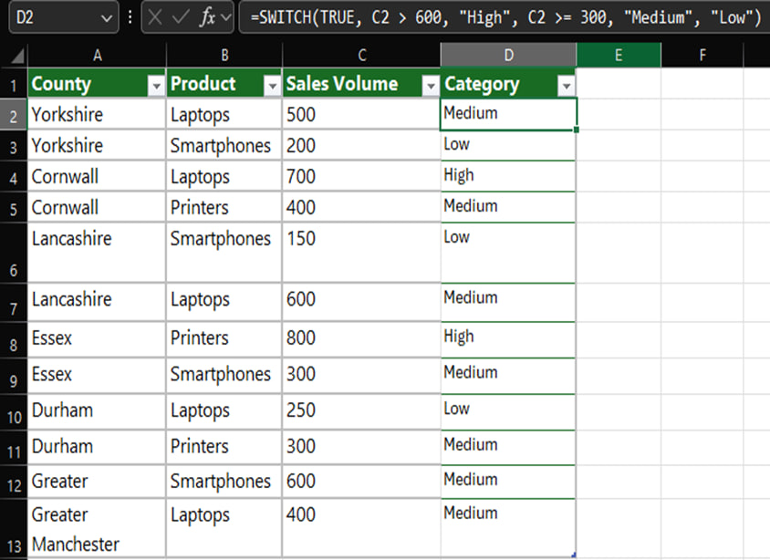
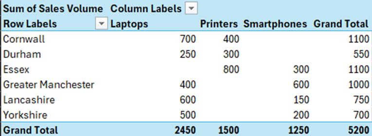
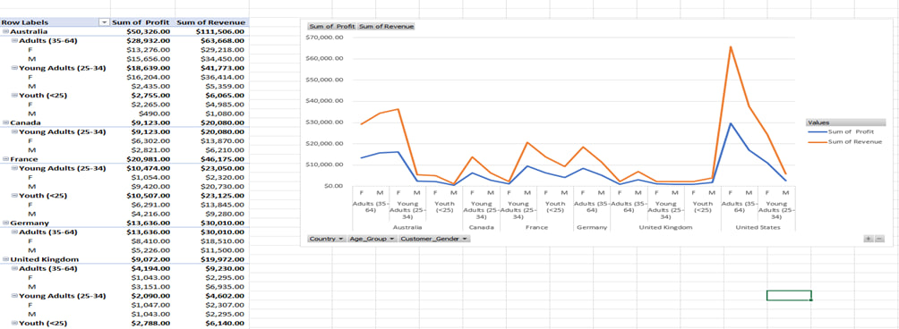
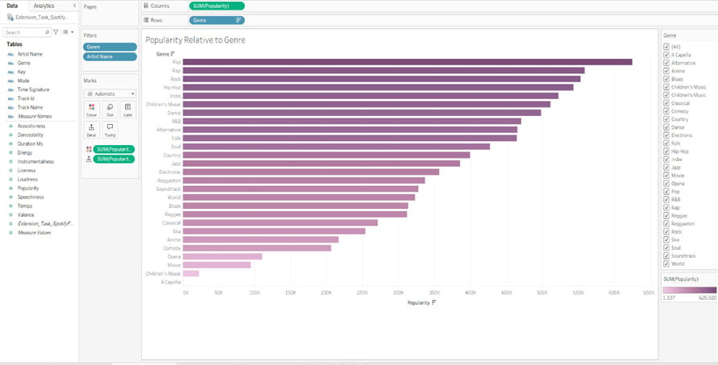
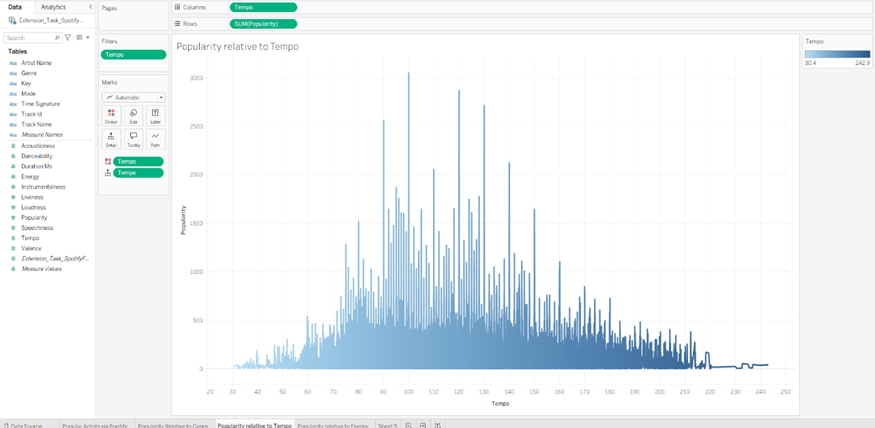
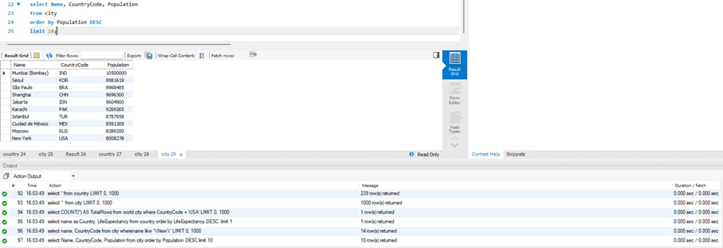
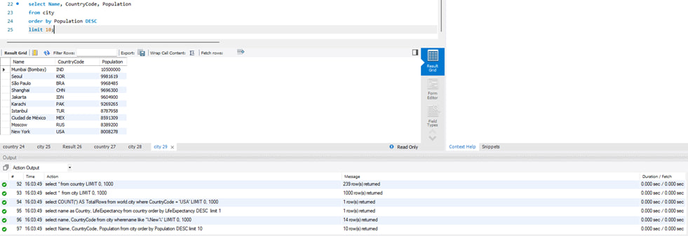
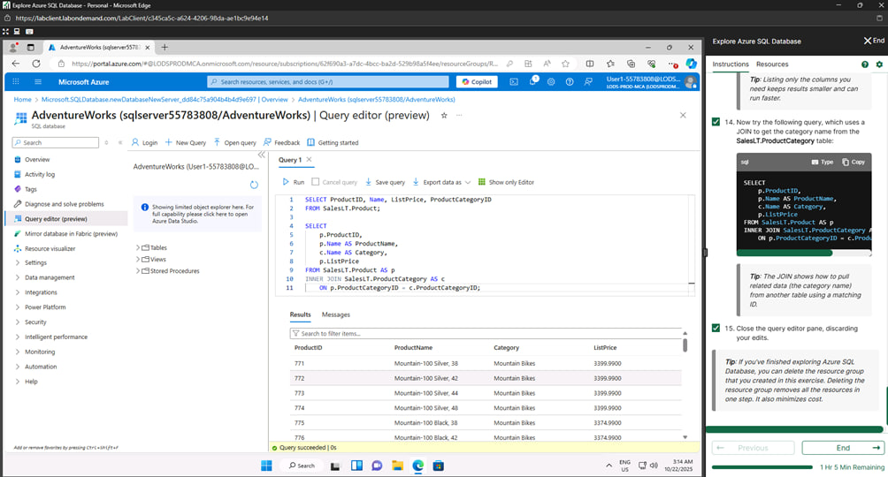

📦 Data Technician Workbook Summaries

This repository contains summaries of key learning modules completed across Excel, Tableau and Power BI, SQL, Azure, and Python. Each section outlines the core tasks, tools, and insights gained during the course.

**🧮 Excel**

Key Skills: Data handling, analysis, visualization, presentation

-Data Legislation: DPA, GDPR, FOIA, Computer Misuse Act

-Data Analysis: Sorting, SUM/AVERAGE formulas, top-score identification, dataset manipulation

-Pivot Tables & Functions:

Customer segmentation via pivots

SWITCH function for sales categories (High/Med/Low)

Pivot-based visualizations

-Presentation Skills:

Tools: Excel, Tableau, Power BI

Techniques: visuals, quantified insights, audience targeting, benchmarking

**📈 Tableau & Power BI**

-Key Skills: Dashboard design, data storytelling

-Tableau:

Compared Public vs. Desktop/Server/Online

Created dashboards (Job Change %, UK city maps)

-Projects:

Spotify: Popularity vs. Energy/Tempo

Health Data: Life expectancy, BMI, NHS planning insights

-Power BI:

Labs on data import, transformation, report & dashboard design

**🗃️ SQL**

Key Skills: Database design, querying, relationships

-Database Concepts:

Keys: Primary, Secondary, Foreign

Relationships: 1-1, 1-many, many-many

-Relational vs. Non-Relational: SQL vs. NoSQL

-SQL Operations: Joins (Inner, Left, Right, etc.), filtering, aggregation, sorting

-Design Project: Retail schema, SQL creation scripts, maintenance (backups, access control)

**☁️ Azure**

Key Skills: Cloud fundamentals, security, architecture

-Concepts: Cloud benefits, models (Public/Private/Hybrid), service types (IaaS/PaaS/SaaS)

-Compliance: GDPR, DPA 2018, PCI DSS, Copyright

-Labs: Relational, non-relational, and analytics services

-DP-900 Certification: 88% score; designed solution for Paws & Whiskers using SQL DB, Blob, Data Lake, Synapse, ML, Power BI

**🐍 Python**

Key Skills: Programming, data analysis, visualization

-Foundations: History, applications, core libraries (Pandas, NumPy, Matplotlib, Seaborn)

-FizzBuzz: Control flow exercise

-Pandas Analysis:

Load/explore datasets

Manipulate, aggregate, pivot, export

Visualize results

-GDP Project: Jupyter-based group analysis on GDP per capita data
